# Project Eudora (Backend)

**Project Eudora** aims to improve its VIP customers’ user experience, by simplifying interactions between the company and the customer through development of an [Android Mobile application](https://play.google.com/store/apps/details?id=io.aruki.eudora&hl=en)

------

**Overview**:

- Objectives: `To enhance VIP customers’ experience and interaction with the firm`
- Scope of the project: `Full stack development of a mobile application & corresponding backend controller`
- User types: `Company staff, Company’s premium customers`
- Scope of the solution: `Dual interface (Employee/User) with specific functions listed under FSD`

## Functionality

### Overview:

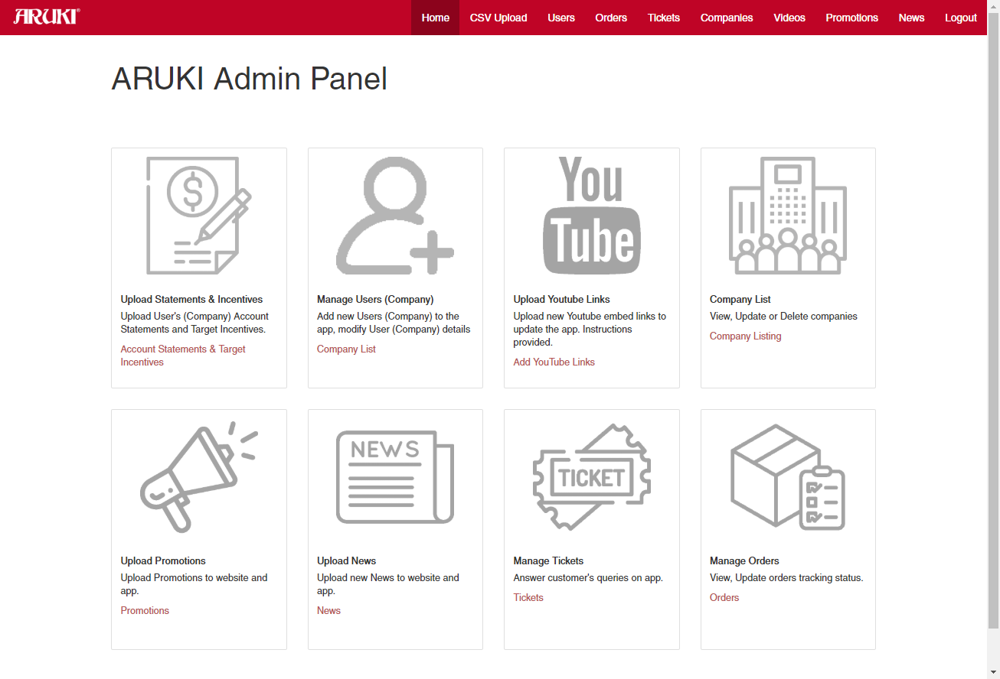

### Live Ticketing system:

Staff can open and respond to any ticket request sent by the android mobile application: 

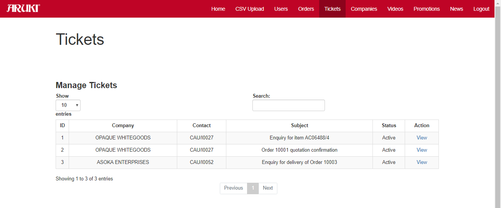

Live chat functionality (Demo):

| Admin panel view                                             | Mobile app view                                              |
| ------------------------------------------------------------ | ------------------------------------------------------------ |
| 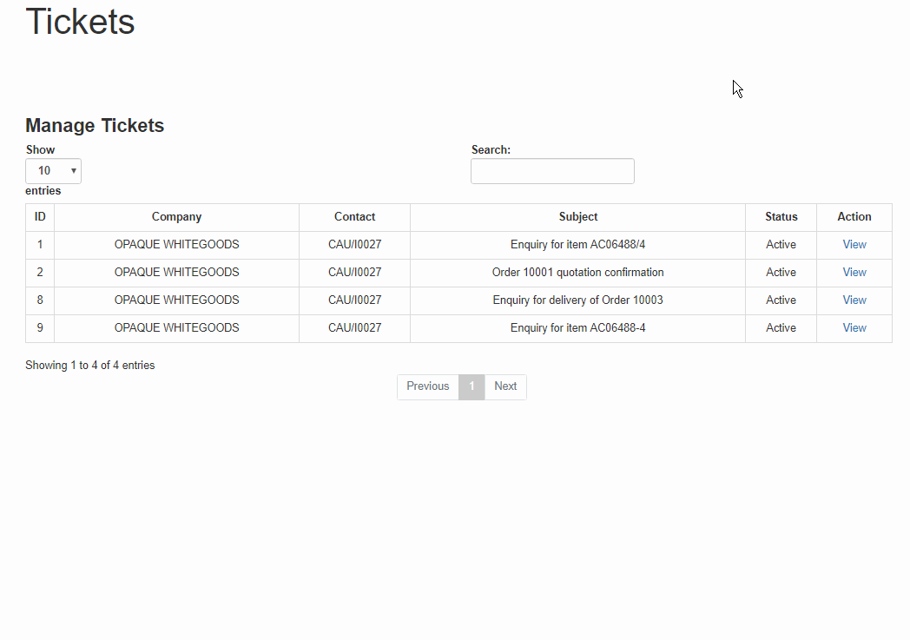 | 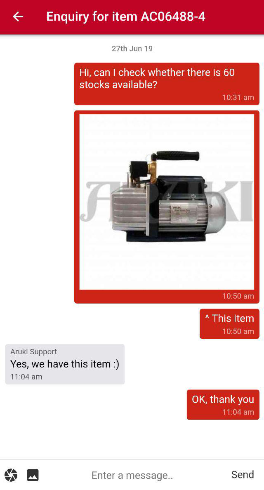 |

------

### Order/ transactions management:

**Upload Statements & Incentives**

Customer current orders and completed transactions are inserted via csv files generated from SAP through `CSV upload panel`, this is to ensure the same order/ transaction code within the entire company.

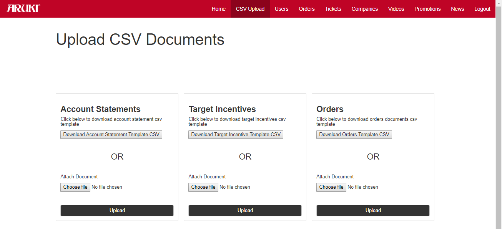

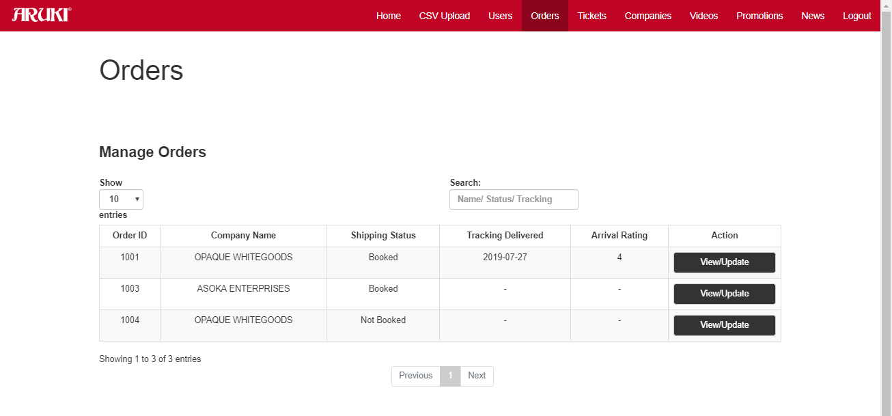

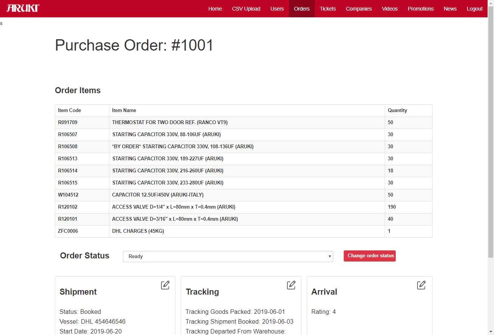

------

### **User Management**

Staff can generate new accounts for VIP customers, via the `User panel` .

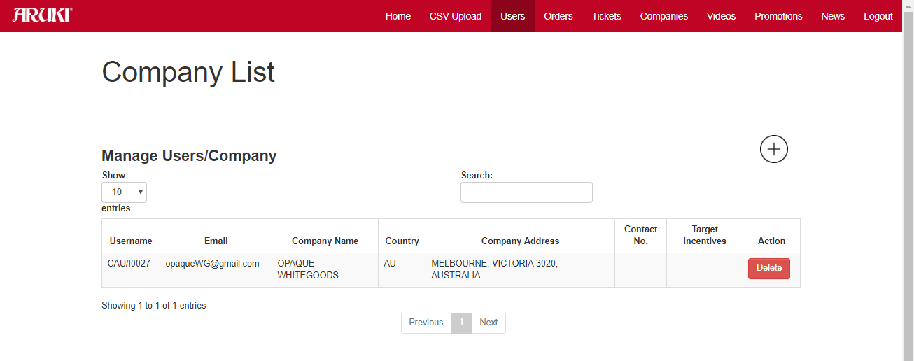

**View, Update or Delete companies**

Staff can set purchase target for various customers for incentive rewards or view contact information via the `Company panel`

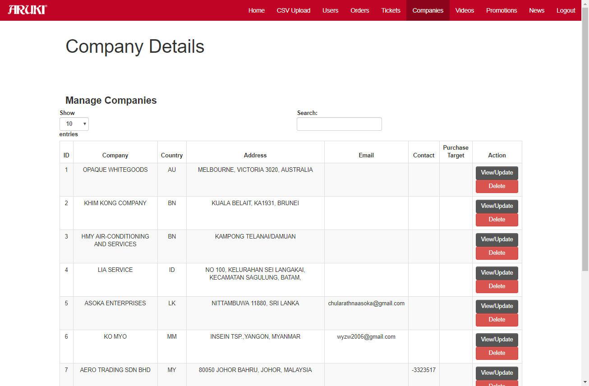

------

### Community management:

**Adding new promotional video**

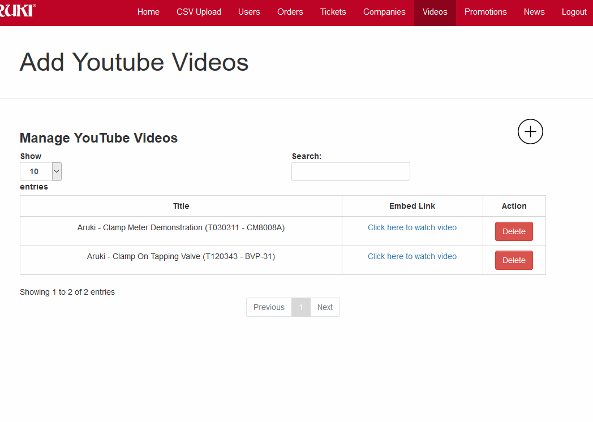

**Adding new promotion**

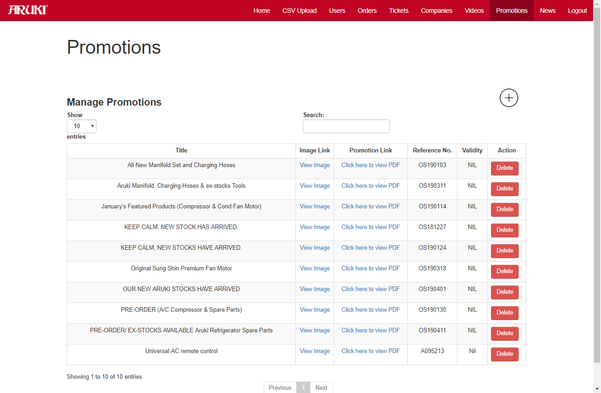

**Adding new News article**

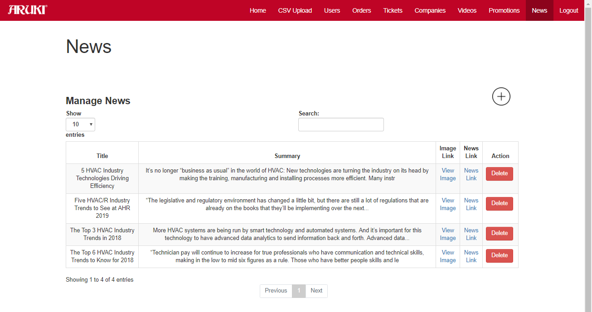

## Documentation

### Architecture Diagram
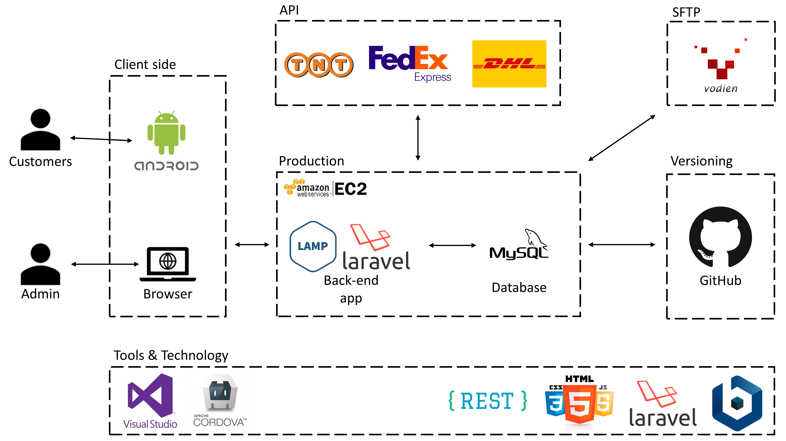
